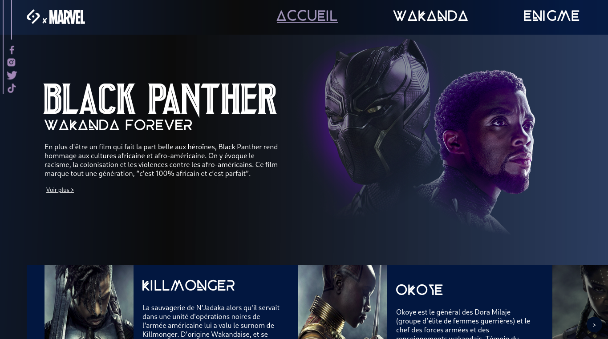
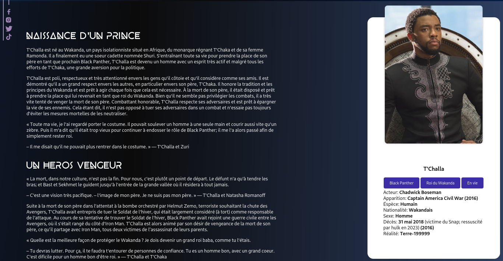
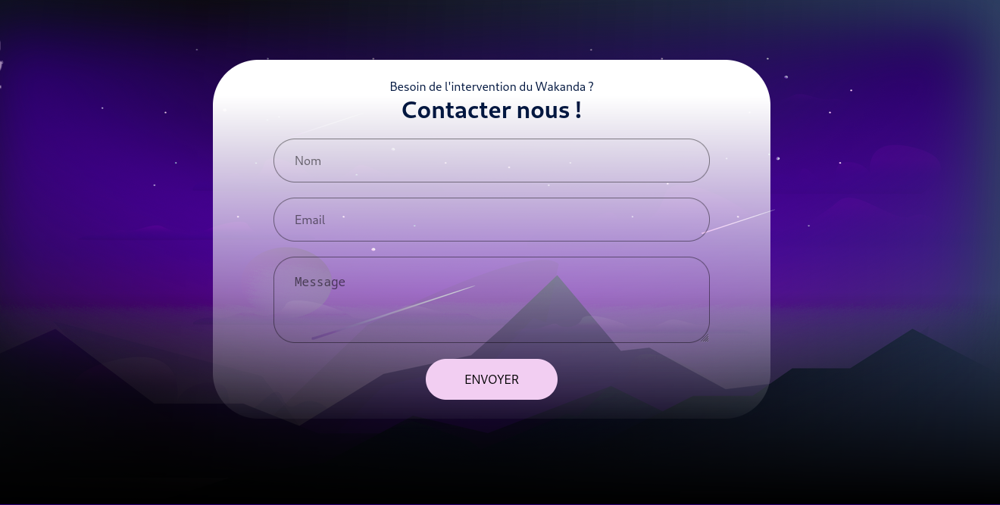

# BLACK PANTHER
This project focuses on development skills in HTML/CSS. These are basic languages for learning computer development, particularly for building websites.

The aim is to build a responsive site, mobile and desktop version, on the BLACK PANTHER universe (Marvel Cinematic Universe - MCU).

You can find the online project [here](https://panther-3ump.onrender.com/)

## Demo

    
    
    

